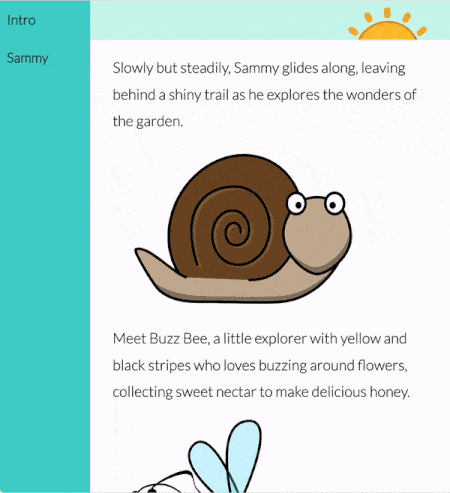

Container Query Height (cqh) are units that specify a size relative to the dimensions of an element's container element.

`1cqh` is 1% of the container's height. For example, if the container's height is 300px, then a value of `10cqh` on a property will be 30px.

One benefit of using `cqh` units rather than `px` (pixel units) for sizing elements is that elements will resize along with their container. This usually happens when you resize a browser window, or view a web page on a different screen.

Here is an example:

In the example, the font size of the the main story text has been set to use `cqh`, so changes with the browser's height.

The font size of the text in the nav bar has been set to use `cqw`, so changes with the browser's width.