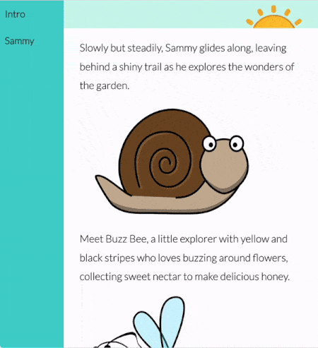

Container query height (cqh) and container query width (cqw) are units that specify a size relative to the dimensions of an element's container element.

`1cqh` représente 1 % de la hauteur du conteneur. Par exemple, si la hauteur du conteneur est de 300px, alors une valeur de `10cqh` sur une propriété sera de 30px.

L’un des avantages de l’utilisation des unités `cqh` plutôt que `px` (unités de pixels) pour dimensionner les éléments est que les éléments seront redimensionnés avec leur conteneur. This usually happens when you resize a browser window, or view a webpage on a different screen.

Voici un exemple :

In the example, the font size of the the main story text has been set to use `cqh`, so it changes with the browser's height.

The font size of the text in the navbar has been set to use `cqw`, so it changes with the browser's width.
